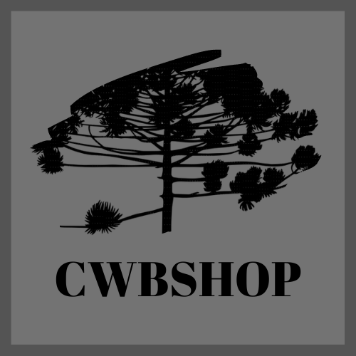

<h1 align="center">
    
    
</h1>
<h2 align="center">CWBShop</h2>

<p align="center">Projeto de Microserviços em JAVA da máteria de Desenvolvimento Web Seguro, prof. Rodrigo Fujioka. Criada uma API Rest utilizando java 11 Spring Boot e Maven, com Service Discovery (Eureka) e gateway para resgistrar as rotas, qualidade do código utilizando SonarQube e testes unitários com Junit 5.</p>

<p align="center">
  

  
  
  <a href="https://github.com/RicardoTaverna/cwbshop/commits/main">
    
  </a>

  
   <a href="https://github.com/RicardoTaverna/cwbshop/stargazers">
    
  </a>

  
</p>


## 💻 Tabela de conteúdos


* [Sobre](#Sobre)
* [Tabela de Conteudo](#tabela-de-conteudo)
* [Tecnologias](#tecnologias)
* [Executar projeto](#executar-projeto)
    * [Pré-requisitos](#pré-requisitos)
    * [Execução](#execução)
    * [Ambiente Desenvolvimento](#Ambiente-Desenvolvimento)
    * [Testes](#Testes)
* [Endpoints](#endpoints)


## 🛠 Tecnologias

As seguintes ferramentas foram usadas na construção do projeto:

- <a href="https://www.oracle.com/br/java/technologies/javase/jdk11-archive-downloads.html">
    
</a>

- <a href="https://maven.apache.org/">
    
</a>

- <a href="https://spring.io/projects/spring-boot">
    
</a>

- <a href="https://www.docker.com">
    
</a>

- <a href="https://www.docker.com">
    
</a>

- <a href="https://www.mysql.com">
    
</a>

- <a href="https://cloud.spring.io/spring-cloud-netflix/reference/html/">
    
</a>


## 🚀 Executar projeto

Para executar esse pojeto você precisa de alguns pré-requisitos:

### 🚥 Pré-requisitos
Antes de começar, você vai precisar ter instalado em sua máquina as seguintes ferramentas:
[Git](https://git-scm.com), [Java 11](https://www.oracle.com/br/java/technologies/javase/jdk11-archive-downloads.html), [Apache Maven](https://maven.apache.org/) e [Docker](https://www.docker.com). 
Além disto é bom ter uma IDE para trabalhar com o código como [IntelliJ](hhttps://www.jetbrains.com/pt-br/idea/).

### ⌛ Execução
```bash
# clonar o repositório 
$ git clone https://github.com/RicardoTaverna/cwbshop.git
```
### 🏭 Ambiente Desenvolvimento

- Com sua IDE aberta, execute na ordem abaixo os projetos:
    - Projeto Eureka: eureka/src/main/java/com/rodrigofujioka/eureka/EurekaApplication.java
    - Projeto Gateway: gateway/src/main/java/com/rodrigofujioka/GatewayAppConfig.java
    - Projeto cwbshop (API): cwbshop/src/main/java/br/pucpr/cwbshop/CwbshopApplication.java
    ```bash
    # na pasta cwbshop/ rode o comando abaixo para criar as pastas corretas dentro de 'target'
    $ mvn clean install
    ```

- Para criar as imagens e subir como containers:
```bash

# Acessar a pasta /cwbshop
$ cd backend/

# criar uma imagem apartir do Dockerfile
$ docker build -t cwbshop-api/cwbshop-service:latest . 

# Acessar a pasta /eureka
$ cd ..
$ cd eureka/

# criar uma imagem apartir do Dockerfile
$ docker build -t cwbshop-api/eureka-service:latest .  

# Acessar a pasta /gateway
$ cd ..
$ cd gateway/

# criar uma imagem apartir do Dockerfile
$ docker build -t cwbshop-api/gateway-service:latest . 

# Subir todos os serviços
$ cd ..
$ docker-compose up


# o servidor do eureka iniciará localhost:8167
# o servidor do gateway iniciará localhost:8080
# o servidor da API iniciará localhost:8060
```

### 🐛 Testes

- Para executar os testes unitários, acesse e execute pela IDE o arquivo: cwbshop/src/test/java/br/pucpr/cwbshop/CwbshopApplicationTests.java
- Para visualizar a cobertura do código:
    - acesse o serviço do SonarQube: localhost:9000
    - entre com o usuário: __admin__ , senha: __admin__
    - de um nome para sua instância de testes e salve o token gerado <TOKEN>
    - acesse o projeto cwb e rode o comando:
    ```bash
    # na pasta cwbshop/ rode o comando abaixo para gerar as métricas no sonarqube
    $ mvn sonar:sonar -login:<TOKEN>
    ```

## 🚧 Endpoints
A documentação no padrão OpenAPI você encontra [aqui](/backend/docs/documentation.yml)